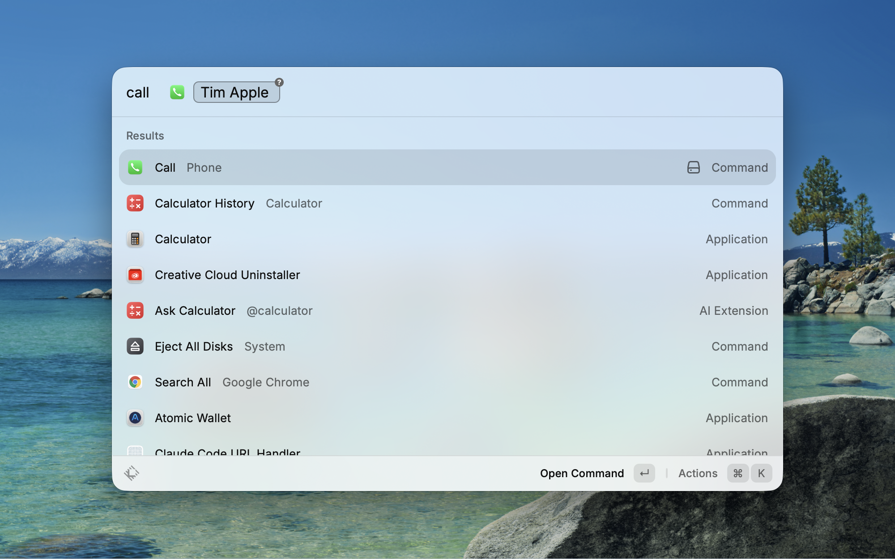

# Phone

Call anyone in your Contacts through your iPhone in two keystrokes — from Raycast, via macOS Continuity.

## How it works

Type **call**, a space, a name, hit Enter.

- One match → call starts immediately
- Several matches → filtered list, Enter on the one you want
- No argument → full contact list with live search

Inside the list:

| Key | Action |
| --- | --- |
| `↩` | Call primary number |
| `⌘A` | FaceTime Audio |
| `⌘V` | FaceTime Video |
| `⌘C` | Copy number |
| `⌘R` | Refresh contacts cache |

## Setup

1. Install the extension.
2. **Recommended:** Raycast → Preferences → Extensions → Phone → Call → set Alias to `call`. This lets you type `call pappa <Enter>` at the Raycast root without pressing Tab.
3. On first run, accept the macOS prompt to let Raycast read your Contacts.
4. On your iPhone: Settings → Phone → Calls on Other Devices → enable your Mac. (Continuity Calling.)

## Privacy

Contacts never leave your Mac. They're cached in Raycast's local storage for 24 hours and refreshable any time with `⌘R`. No network requests, no analytics, no telemetry.

## Why this exists

The existing Quick Call extension requires you to type the full number. This one searches your Contacts and dials the right person with one keystroke.
